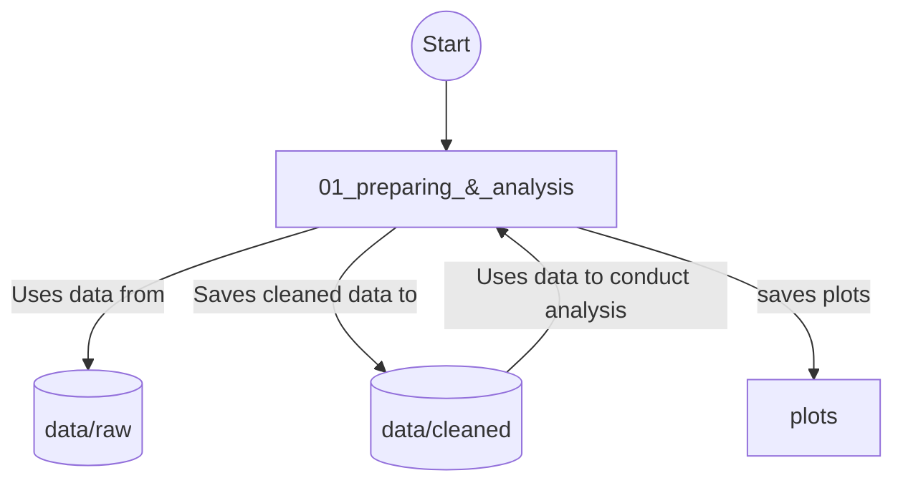

# Trading_Pollution
This repository contains all the steps to produce the paper "TITLE". I have used python to prepare the dataset and to plot the lines, R studio to produce the bump charts and Stata18.5 for panel data analysis. The folder `01_preparing_&analysis` contains notebook, rmd and do file. Raw subfolder of the data folder contains all the raw data downloaded from WDI, except the embodied emission data downloaded from OECD data explorer as it is more than 2GB. Reproduction of the data cleaning proceess requires downloaded the zip file from the following link and extracting the csv file 'DF_TRADE' in the raw subfolder,
https://data-explorer.oecd.org/vis?tm=DF_ICIO_GHG_TRADE_2023&snb=5&df[ds]=dsDisseminateFinalDMZ&df[id]=DSD_ICIO_GHG_TRADE%40DF_ICIO_GHG_TRADE_2023&df[ag]=OECD.STI.PIE&df[vs]=1.0&dq=A.TRADE_GHG.W.._T..T_CO2E&pd=2020%2C&to[TIME_PERIOD]=false

The following mermaid plot illustrates the data journey,

