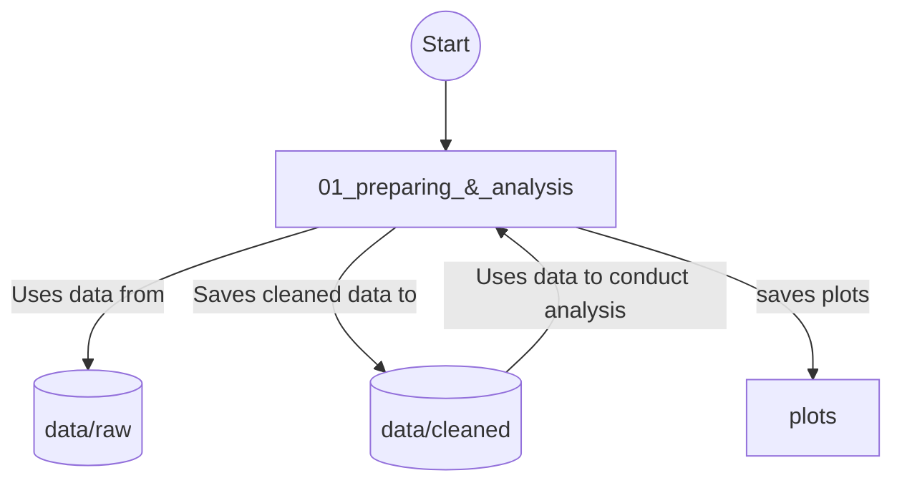

# Trading_Pollution

```mermaid
flowchart TD
    A((Start)) --> B[01_preparing_&_analysis]
    B -->|Uses data from| C[(data/raw)]
    B -->|Saves cleaned data to| D[(data/cleaned)]
    D --> |Uses data to conduct analysis| B[01_preparing_&_analysis]
    B -->|saves plots|E[plots]
```
